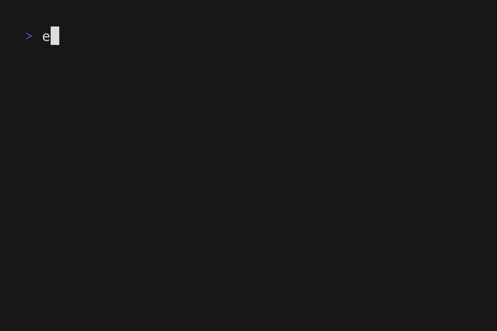

# flatpak-alias

A simple go application that generate aliases for flatpak applications



## Installation

Download the latest release for your platform from the [Releases](https://github.com/RedCommand/flatpak-alias/releases) page or build from source:

```bash
git clone https://github.com/RedCommand/flatpak-alias.git
cd flatpak-alias
./install.sh
# or
# sudo go build -o /usr/share/flatpak/triggers/flatpak-alias.trigger
```

## Usage

This application is not meant to be used directly! You just install it and it will generate aliases for you! 🎉🎉🎉

## Usage (CLI)

```bash
flatpak-alias [directory]
```

The directory is the path to the Flatpak installation. flatpak-alias will create a folder called `aliases` in the specified directory.

> If no directory is specified, it defaults to `/var/lib/flatpak`. It creates an aliases folder and generates scripts for each Flatpak application.

## License

This project is distributed under the MIT License.
